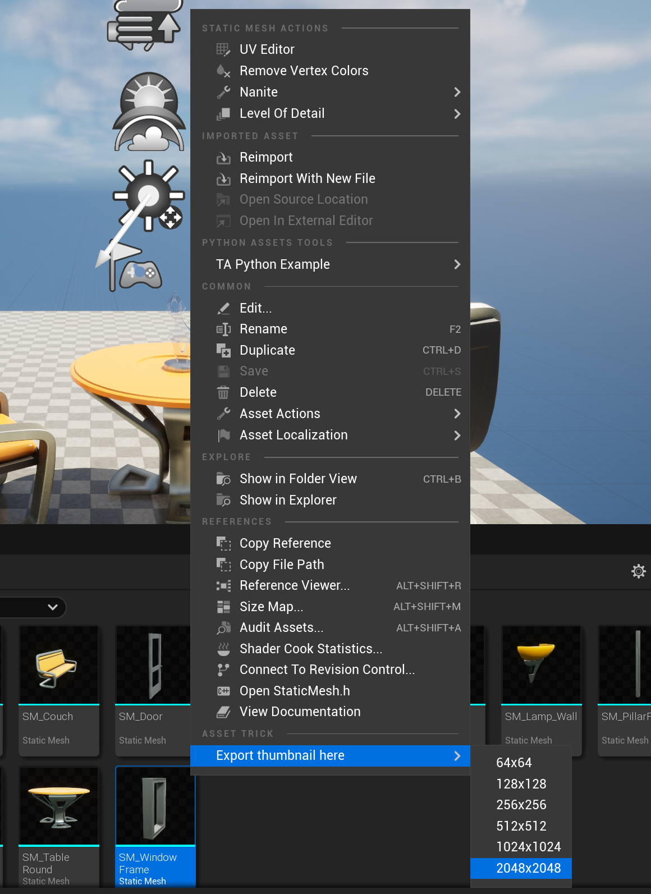

# UE AssetThumbnailGenerator

在编辑器下，生成资产的缩略图为纹理（Texture）

# 运行环境

- Unreal Engine 5.2
- Plugin
- Windows 64 Bit

# 使用方法

- 放入Plugins目录下（Project或Engine）

# 功能

1. 生成资产的缩略图纹理
2. 支持的分辨率：64x64 ~ 2048x2048

# 说明

- **对于某些资产第一次生成不成功，第二次可以成功。**（未解决！）
